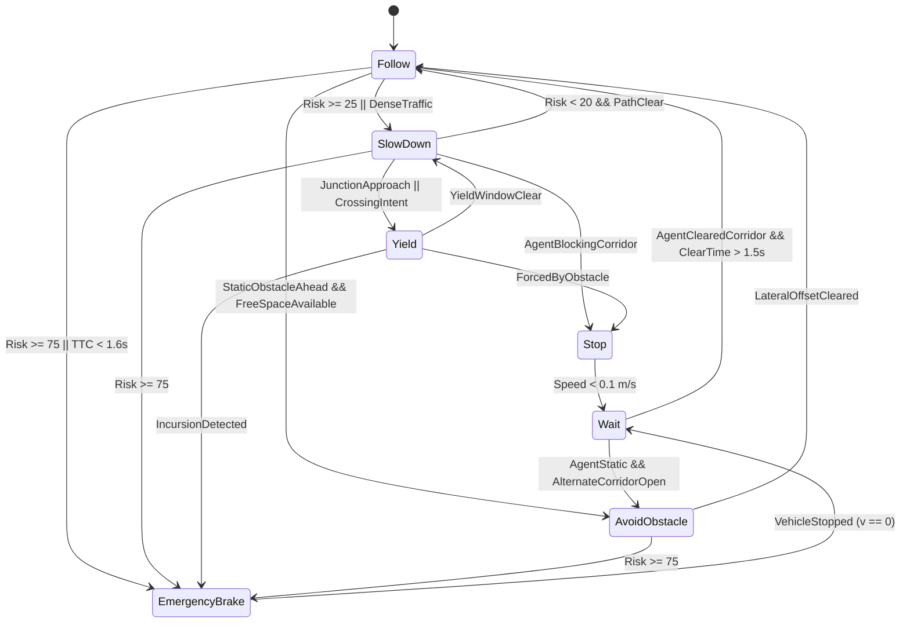

# Stateflow Decision Logic Specification

## Architecture Overview
In Simulink / Stateflow, the behavioral decision manager is implemented as a deterministic hierarchical statechart operating at 20 Hz ($T_s = 0.05\,\text{s}$).

## State Hierarchy & Transition Guards

### 1. `Follow` (Default State)
- **Entry Action**: `target_speed = CruiseSpeed; target_d = 0.0; safety_margin = 1.0;`
- **During**: Track centerline / nominal free-space spline.
- **Exit to `SlowDown`**: `[overall_risk >= 25.0 || surrounding_density > 0.6]`
- **Exit to `AvoidObstacle`**: `[obstacle_in_corridor && abs(obstacle_dy) < 1.8 && free_space_width >= 3.0]`
- **Exit to `EmergencyBrake`**: `[overall_risk >= 75.0 || min_ttc <= 1.6]`

### 2. `SlowDown`
- **Entry Action**: `target_speed = CruiseSpeed * 0.6; safety_margin = 1.2;`
- **Exit to `Follow`**: `[overall_risk < 20.0 && path_is_clear]`
- **Exit to `Yield`**: `[is_intersection_zone && crossing_agents_detected]`
- **Exit to `EmergencyBrake`**: `[overall_risk >= 75.0 || min_ttc <= 1.6]`

### 3. `Stop`
- **Entry Action**: `target_speed = 0.0; brake_cmd = 0.6;`
- **Exit to `Wait`**: `[ego_velocity < 0.1]`

### 4. `Wait`
- **Entry Action**: `hold_timer = 0; gear = 'P';`
- **During**: `hold_timer = hold_timer + dt;`
- **Exit to `Follow`**: `[blocking_agent_distance > 15.0 && hold_timer > 1.5]`

### 5. `AvoidObstacle` (Nudge)
- **Entry Action**: `target_d = (obs_dy >= 0 ? -1.8 : 1.8); target_speed = min(CruiseSpeed * 0.5, 5.0);`
- **Exit to `Follow`**: `[ego_s > obstacle_s + 8.0]`

### 6. `EmergencyBrake`
- **Entry Action**: `target_speed = 0.0; brake_cmd = 1.0; log_emergency_event();`
- **During**: Max deceleration ($a = -6.5\,\text{m/s}^2$).
- **Exit to `Wait`**: `[ego_velocity < 0.05]`
